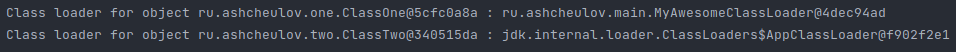

# Лабораторная работа 4

## Задание

Ознакомиться с руговодством по загрузке классов и ClassLoader.
Продемонстрировать работу своего загрусчика классов. 
Определить разницу между своей и стандартной реализацией.

## Разработка

### Структура проекта
```
├── pom.xml
├── README.md
└── src
    └── main
        └── java
            └── ru
                └── ashcheulov
                    ├── main
                    │   ├── MainClass.java
                    │   └── MyAwesomeClassLoader.java
                    ├── one
                    │   ├── ClassOne.java
                    │   └── InterfaceOne.java
                    └── two
                        └── ClassTwo.java

```

## Результат разработки

Для демонстрации работы собственного загрусчика классов были разработаны два класса 
[`ClassOne`](/src/main/java/ru/ashcheulov/one/ClassOne.java) 

```java
package ru.ashcheulov.one;

/**
 *
 * @author Ashcheulov & Kravtcov Timofey
 */
public class ClassOne implements InterfaceOne {
    @Override
    public String printStr() {
        return "Hello, Java, from ClassOne";
    }
}
```

[`ClassTwo`](/src/main/java/ru/ashcheulov/two/ClassTwo.java).

```java
package ru.ashcheulov.two;

import ru.ashcheulov.one.ClassOne;
import ru.ashcheulov.one.InterfaceOne;

/**
 *
 * @author Ashcheulov Mikhail & Kravtcov Timofey
 */
public class ClassTwo {
    public void methodWithParam(InterfaceOne c) {
        System.out.print("ClassTwo(withParam):");
        System.out.println(c.printStr());
    }
    
    public void methodWithoutParam() {        
        ClassOne c = new ClassOne();        
        System.out.print("ClassTwo(withoutParam):");
        System.out.println(c.printStr());
    }
}
```

[`MyAwesomeClassloader`](/src/main/java/ru/ashcheulov/main/MyAwesomeClassLoader.java)
имеет:
1. Метод `loadClassData` считывает файл класс из файловой системы
2. Метод `findClass` находит класс по заданному имени
3. Конструктор, в котором задаётся директория искомых классов

```java
package ru.ashcheulov.main;

import java.io.File;
import java.io.FileInputStream;
import java.io.FileNotFoundException;
import java.io.IOException;
import java.io.InputStream;
import java.net.URL;
import java.nio.ByteBuffer;
import java.util.HashMap;
import java.util.logging.Level;
import java.util.logging.Logger;

/**
 *
 * @author Ashcheulov Mikhail & Kravtcov Timofey
 */
public class MyAwesomeClassLoader extends ClassLoader {
    private final HashMap<String, Class<?> > cash;

    private String pathToClasses;
    
    MyAwesomeClassLoader() {
        cash = new HashMap<>();
        this.pathToClasses = "target/classes/";
    }

    public void setPathToClasses(String pathToClasses) {
        this.pathToClasses = pathToClasses;
    }
    
    @Override
    public Class<?> findClass(String name) throws ClassNotFoundException{
        if (cash.containsKey(name))
            return cash.get(name);
       try {
            File classFile = new File(this.pathToClasses + name.replace('.', '/') + ".class");
            if (!classFile.exists() | !classFile.canRead())
                throw new FileNotFoundException();
            
            InputStream classFileStream = new FileInputStream(classFile);
            loadClassData(name, classFileStream);
                       
            return cash.get(name);            
        } catch (FileNotFoundException ex) {
            Logger.getLogger(MyAwesomeClassLoader.class.getName()).log(Level.SEVERE, null, ex);
            
            System.out.println("Try to find class in jar");
            //Try to find in jar file            
            try {
                final URL jarUrl = new URL("jar:file:jarWithClasses.jar!/" + name.replace('.', '/') + ".class");
                System.out.println(jarUrl.getFile());
                InputStream classFileStream = jarUrl.openStream();
                                
                loadClassData(name, classFileStream);
                
                return cash.get(name);
            } catch (IOException ex1) {
                Logger.getLogger(MyAwesomeClassLoader.class.getName()).log(Level.SEVERE, null, ex1);
            }

            return super.findClass(name);                       
        } catch (IOException ex) {
            Logger.getLogger(MyAwesomeClassLoader.class.getName()).log(Level.SEVERE, null, ex);
            throw new ClassNotFoundException();
        }   
    }   
    
    private void loadClassData(String name, InputStream classFileStream) throws IOException {        
        ByteBuffer b = ByteBuffer.wrap(classFileStream.readAllBytes());
        cash.put(name, defineClass(name, b, null));
    }   
}
```

В результате выполнения программы загружаются два класса. Названия загрузчиков выводятся в консоль


Разница между своей и стандартной реализацией:
1. Возможность динамически загружать файлы из локальной файловой системы или полученные во время выполнения;
2. Можно полностью контролировать процесс загрузки абсолютно всех Java-классов;
3. Нельзя сделать с помощью ClassLoader новый класс, не располагая его байт-кодом.

## Работа выполнена

[Ащеулов Михаил ПИМ-21](https://github.com/VergiliusAW)

[Кравцов Тимофей ПИМ-21](https://vk.com/timofeykrav)